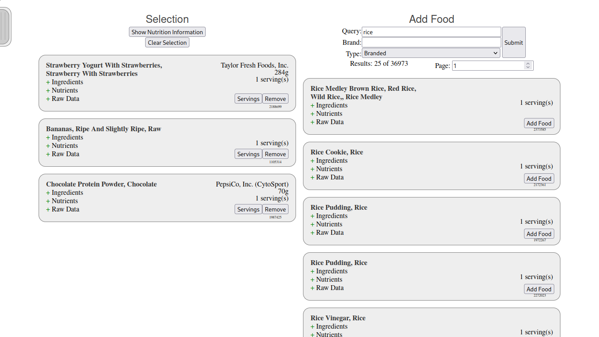
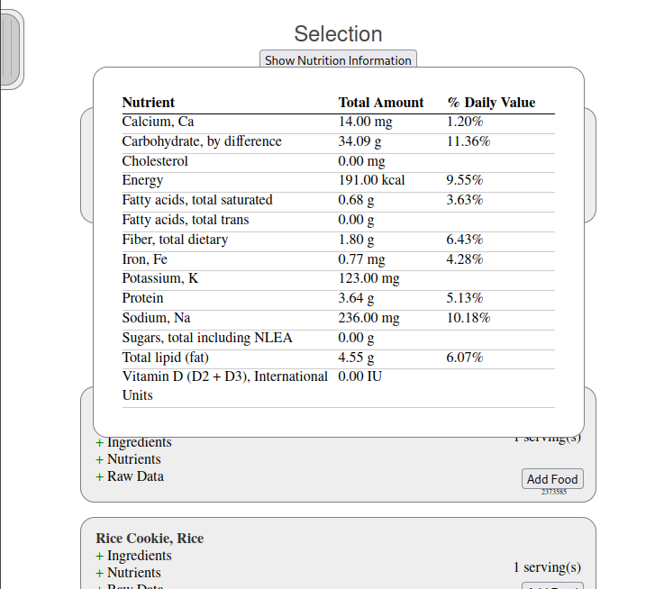

## Overview

This is an application that helps users plan meals and nutrient consumption by
taking advantage of the USDA's data provided through the USDA Global Branded
Food Products Database and other data sources.

## Screenshots

<div>


</div>

## Features
- Search for foods in the USDA Global Branded Food Products Database
- Calculate the nutrient value of a collection of foods
- Export and import collections of foods using a JSON file format
- Environment configuration using a .env file for security
- Search multiple data types and paginate results
- List the ingredients of any food item
- Configurable filter to alert for specified ingredients
- Display of percent of recommended daily value when applicable
- Configurable serving sizes
- Persistent session management

## Usage

Use `npm i` to install node modules.

Create a file called `.env` in the same directory as `index.js` with your API
key and port. You can get an API key for free from from <a
href="https://fdc.nal.usda.gov/">the FoodData Cental Website</a>.

```
API_KEY="YOUR_KEY"
PORT=3000
SECRET="YOUR_SECRET"
```

Run the server with `npm start`.

Alternatively, use `nodemon index.js` for ease of development.

## License

This work is licensed under the GNU General Public License version 3 (GPLv3).

[](https://www.gnu.org/licenses/gpl-3.0.en.html)
